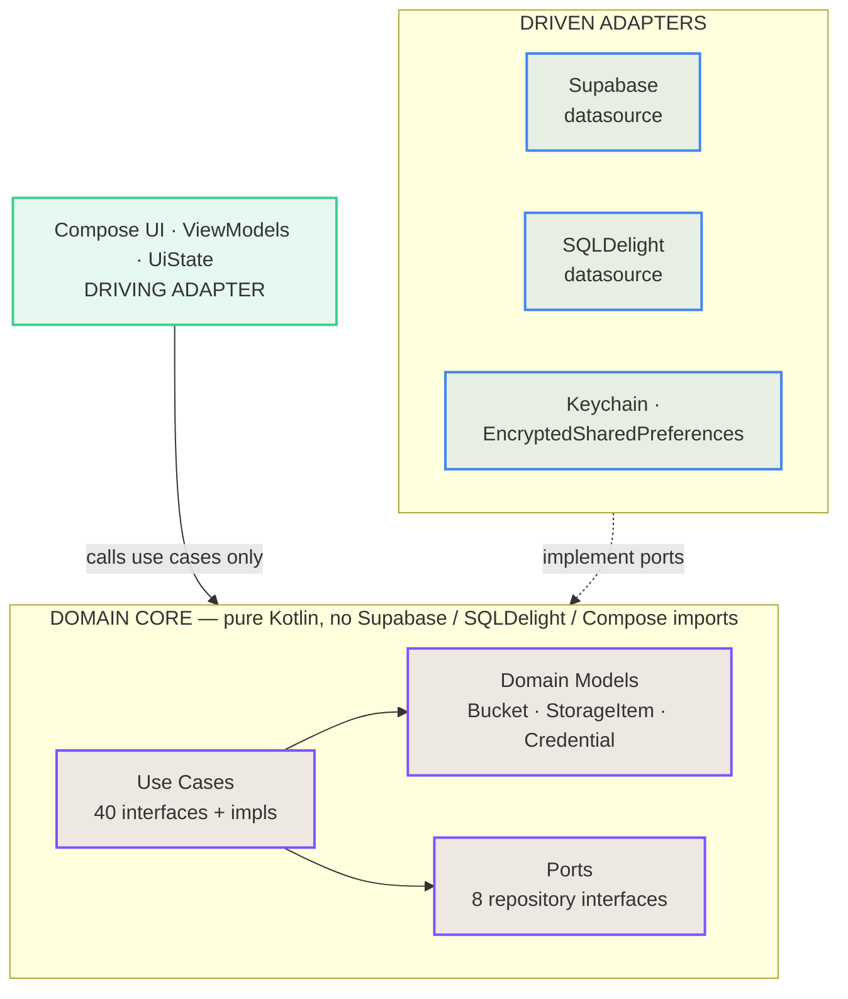

<div align="center">

# SupaBuckt

**Manage your Supabase Storage from your pocket.**

A production Kotlin Multiplatform app for browsing, uploading, downloading and organising
Supabase Storage buckets — shipping on the App Store and Google Play, built with one shared
Compose Multiplatform codebase.

[](LICENSE)
[](https://kotlinlang.org)
[](https://www.jetbrains.com/lp/compose-multiplatform/)
[](#platform-support)

[**Website**](https://hieuwu.github.io/supabuckt-landing/) ·
[**App Store**](https://apps.apple.com/us/app/supabuckt-supabase-storage/id6759938222) ·
[**Google Play**](https://play.google.com/store/apps/details?id=com.hieuwu.supabasestorageclient) ·
[**Privacy**](https://hieuwu.github.io/supabuckt-landing/privacy-policy.html)

<a href="https://apps.apple.com/us/app/supabuckt-supabase-storage/id6759938222"></a>
<a href="https://play.google.com/store/apps/details?id=com.hieuwu.supabasestorageclient"></a>

<br /><br />


</div>

---

## Contents

- [Why](#why)
- [Features](#features)
- [Screenshots](#screenshots)
- [Tech stack](#tech-stack)
- [Architecture](#architecture)
- [Project structure](#project-structure)
- [Getting started](#getting-started)
- [In-app purchases (RevenueCat)](#in-app-purchases-revenuecat)
- [Security model](#security-model)
- [Platform support](#platform-support)
- [Contributing](#contributing)
- [License](#license)

---

## Why

The Supabase dashboard is excellent on a desktop and painful on a phone. SupaBuckt is a
native, touch-first client for the part of it developers reach for most often: **Storage**.

It is also a complete, real-world reference for a shipped Kotlin Multiplatform app — one
that has to deal with the things sample projects skip: encrypted credential storage,
background transfers with resumable state, offline caching, per-project data isolation,
onboarding, theming, and subscriptions on two stores.

---

## Features

### Multi-project command center
Store and switch between multiple Supabase projects. Credentials are held in
platform-backed encrypted storage — Android Keystore-derived encryption on Android,
Keychain on iOS — and never leave the device. Switching projects swaps the active
Supabase client and re-scopes every cached row.

### Bucket explorer, list or grid
Browse buckets and nested folders in either layout. Create, update, empty and delete
buckets. Move and delete files. Create folders. Listings are mirrored into a local SQLDelight
cache on every successful fetch, so a dropped connection falls back to the last known state
instead of an error screen.

### Background uploads & downloads
`UploadManager` and `DownloadManager` run transfers off the UI, tracking per-item progress
and status in SQLite so a transfer survives navigation and process death. Cancel in flight,
resume, and choose a download destination per file or set a default path.

### Starred items
Pin buckets, folders or files for one-tap access. Stars are scoped per credential, so each
project keeps its own set.

### Search
Real-time search across buckets and file paths with typed results.

### File viewer
Inline image viewing with platform viewers for other types, plus a metadata inspector
(size, MIME type, timestamps) and one-tap public URL copy.

### Polished by default
Material 3, system-aware light/dark/auto theming, shimmer loading states, empty states,
a splash screen, and a three-slide onboarding flow that includes an explicit service-role-key
security warning.

---

## Screenshots

### iOS

| **Buckets · list** | **Buckets · grid** | **Browse files** |
|:---:|:---:|:---:|
|  |  |  |

| **File viewer** | **Credentials** | **Create bucket** |
|:---:|:---:|:---:|
|  |  |  |

| **Downloads** | **Starred · dark** | **Settings · dark** |
|:---:|:---:|:---:|
|  |  |  |

### Android

| **Buckets · list** | **Browse · grid** | **Files & folders** |
|:---:|:---:|:---:|
|  |  |  |

| **File viewer** | **Credentials** | **Create bucket** |
|:---:|:---:|:---:|
|  |  |  |

| **Upload files** | **Downloads** | **Starred** |
|:---:|:---:|:---:|
|  |  |  |

| **Buckets · dark** | **Downloads · dark** | **Settings** |
|:---:|:---:|:---:|
|  |  |  |

---

## Tech stack

| Concern | Choice |
| --- | --- |
| Language | Kotlin 2.4.0 (Multiplatform) |
| UI | Compose Multiplatform 1.11.1, Material 3 |
| Architecture | Clean Architecture / ports & adapters, MVVM presentation |
| DI | Koin 4.2 (`koin-compose-viewmodel`) |
| Backend SDK | [supabase-kt](https://github.com/jan-tennert/supabase-kt) 3.6 — Storage, Postgrest, Auth |
| Networking | Ktor 3.5 (Android engine on Android, Darwin on iOS) |
| Local database | SQLDelight 2.3 |
| Key–value storage | multiplatform-settings 1.3, over EncryptedSharedPreferences (Android) / Keychain (iOS) |
| Navigation | Navigation Compose 2.9 |
| Images | Coil 3.5 (+ Ktor network fetcher) |
| File picking | FileKit 0.14 |
| Subscriptions | RevenueCat `purchases-kmp` 3.2 (+ RevenueCat UI paywall) |
| Build-time config | BuildKonfig 0.22 |
| Logging | Kermit 2.1 |
| Build | Gradle 8.14.3, AGP 8.11.2, version catalog, configuration cache |

---

## Architecture

Clean Architecture with an explicit ports-and-adapters boundary. The domain layer owns the
contracts; `data` supplies the adapters; `presentation` consumes use cases only. Nothing in
`domain` imports Supabase, SQLDelight, or Compose.



Both arrows point **inward**. The UI depends on use case interfaces and nothing else; the
adapters depend on ports the domain declares. The domain itself depends on neither, so it
compiles with no knowledge that Supabase, SQLDelight or Compose exist — and is testable
without any of them.

**Decisions worth noting for anyone reading the source:**

- **Use cases are interface + impl pairs.** `GetBucketsUseCase` is an interface in
  `domain/usecase/`; `GetBucketsUseCaseImpl` lives in `domain/usecase/impl/`. ViewModels depend
  on the interface, so they are trivially fakeable without a mocking library. The simpler ones
  are `fun interface`s, so a fake is a one-line lambda.
- **`operator fun invoke`** on use cases keeps call sites reading as `getBuckets()`.
- **`ApiResponse<T>`** (`Loading` / `Success` / `Error`) is the single transport for
  asynchronous results, surfaced to the UI as `Flow<ApiResponse<T>>`.
- **Reads are network-first with the cache as fallback.** `StorageRepositoryImpl` hits Supabase,
  mirrors the result into SQLDelight on success, and falls back to the cache only when the
  request throws. An empty cache rethrows the original exception rather than showing a
  misleading empty state, so the cache is a resilience layer, not a read-through cache.
- **Every cached table is keyed by `credential_id`.** All five tables carry it in their primary
  key, so multiple Supabase projects share one database file with no cross-project leakage.
  `SupabaseClientManager` holds the active client as a `StateFlow<SupabaseClient?>`; switching
  credentials emits a new client and `App.kt` re-routes navigation in response.
- **Platform differences are narrow.** Only clipboard, file writing, external viewers, the
  SQLDelight driver and the settings backend are `expect`/`actual` — which is what keeps the
  shared-code figure at ~95%.
- **DI is 6 shared Koin modules** (database, repository, supabase, usecase, utility, viewmodel)
  plus an `expect fun platformModule()` contributing the platform-specific bindings.

---

## Project structure

```
composeApp/src/
├── commonMain/         172 files — all business logic and UI
│   ├── kotlin/…/core/          formatting, date and file helpers
│   ├── kotlin/…/data/          repositories, datasources, DTOs, network
│   ├── kotlin/…/di/            6 Koin modules + expect platformModule()
│   ├── kotlin/…/domain/        models, ports, use cases, managers
│   ├── kotlin/…/platform/      expect declarations
│   ├── kotlin/…/presentation/  screens, ViewModels, theme, navigation
│   ├── composeResources/       drawables
│   └── sqldelight/             AppDatabase.sq — 5 tables
├── androidMain/        EncryptedSharedPreferences, Android driver, Application
├── iosMain/            Keychain settings, native driver, iOS entry
├── jvmMain/            desktop actuals (experimental)
├── jsMain/ wasmJsMain/ web actuals (experimental — see Platform support)
└── commonTest/         placeholder test

iosApp/                 SwiftUI host (iOSApp.swift → ContentView → ComposeApp)
gradle/libs.versions.toml   version catalog
```

---

## Getting started

### Prerequisites

- **JDK 17+**
- **Android Studio** Ladybug or newer (or IntelliJ IDEA with the KMP plugin)
- **Xcode 15+** — macOS only, for the iOS target
- A **Supabase project** with at least one storage bucket

### 1. Clone and configure

```bash
git clone https://github.com/hieuwu/supabase-storage-client.git
```

```bash
cd supabase-storage-client && cp local.properties.example local.properties
```

You can leave the RevenueCat keys empty — see
[In-app purchases](#in-app-purchases-revenuecat). Android Studio writes `sdk.dir` into
`local.properties` for you on first Gradle sync; add it by hand only if you build purely from
the CLI. `local.properties` is git-ignored and must never be committed.

### 2. Run Android

```bash
./gradlew :composeApp:installDebug
```

Or pick the `composeApp` run configuration in Android Studio.

### 3. Run iOS

Open `iosApp/iosApp.xcodeproj` in Xcode, select a simulator, and run. Gradle builds the
shared framework automatically as part of the Xcode build.

To build the framework on its own:

```bash
./gradlew :composeApp:linkDebugFrameworkIosSimulatorArm64
```

### 4. Add your credentials in-app

On first launch the onboarding flow explains the security trade-off, then asks for:

- **Project URL** — `https://<project-ref>.supabase.co`
- **API key** — anon key or service role key (read [Security model](#security-model) first)

Both are found in your Supabase dashboard under **Project Settings → API**.

### Useful tasks

```bash
./gradlew :composeApp:compileDebugKotlinAndroid
```

```bash
./gradlew :composeApp:assembleDebug
```

```bash
./gradlew allTests
```

---

## In-app purchases (RevenueCat)

SupaBuckt is free to use with **up to 2 Supabase projects**. A subscription unlocks
unlimited projects. That single check — in
[`CredentialsViewModel`](composeApp/src/commonMain/kotlin/com/hieuwu/supabasestorageclient/presentation/credentials/CredentialsViewModel.kt)
— is the only functional gate in the app; everything else is presentational.

### Building without RevenueCat

**You do not need a RevenueCat account to build, run, or develop this app.** Leave both keys
blank. `BuildKonfig` then compiles an empty string, `Purchases.configure("")` fails, the
failure is caught, and `isPro` stays `false`. Every storage feature works normally on the free
tier. The one path that will not behave is the paywall itself: opening it with no key shows
RevenueCat's error state instead of a real offering.

### How the keys are wired

Keys live in `local.properties`, which is git-ignored and never checked in. At Gradle
configuration time `composeApp/build.gradle.kts` loads that file and reads
`revenuecat.api.key.android` and `revenuecat.api.key.ios`, falling back to an empty string
when either is absent. BuildKonfig then generates `BuildKonfig.REVENUECAT_API_KEY` separately
for each target — `android`, `iosArm64` and `iosSimulatorArm64` — so the Android binary embeds
only the `goog_` key and the iOS binaries only the `appl_` key. `PurchaseRepositoryImpl` reads
that generated constant and passes it to `Purchases.configure`, meaning no key ever appears in
source, and swapping accounts is a one-line change in an untracked file.

> **On key sensitivity.** These are RevenueCat **public SDK keys**. They are designed to be
> embedded in client binaries — anyone can extract them from any shipped app, and they cannot
> move money, issue refunds, or read another account's data. They are *not* the same class of
> secret as a RevenueCat **secret key** (`sk_…`), which must only ever live on a server.
> They are still account-scoped, so use your own rather than someone else's, and keep them out
> of version control as this project does.

### Setting it up for your own fork

1. Create a project at [app.revenuecat.com](https://app.revenuecat.com).
2. Connect your App Store Connect and Google Play Console apps.
3. Create your products and an **Offering** marked *current*.
4. Copy **Project settings → API keys → Public SDK key** for each platform into
   `local.properties`.
5. Design the paywall in RevenueCat's dashboard — the app renders it via
   RevenueCat UI's `Paywall` composable, so no code change is needed.

Note that `PurchaseRepositoryImpl` reads `customerInfo.activeSubscriptions` rather than a
named entitlement, so any active subscription grants Pro. If you prefer entitlement-based
gating, change `updateProStatus`.

### StoreKit local testing (iOS)

`iosApp/*.storekit` files drive local purchase testing in Xcode without App Store Connect.
`Premium.storekit` carries a placeholder for the subscription-offer signing key:

```json
"privateKey" : "PROVIDE_THIS_FROM_APPSTORE_CONNECT"
```

Paste your own key there for local testing only, and **do not commit it**. Use
`git update-index --skip-worktree iosApp/Premium.storekit` while testing if you want to be
sure it cannot be staged by accident.

### Release signing (Android)

The release signing config reads environment variables, so no keystore or password is stored
in the repo:

```bash
export ANDROID_KEYSTORE_FILE=/path/to/release.jks
export ANDROID_KEYSTORE_PASSWORD=…
export ANDROID_KEY_ALIAS=…
export ANDROID_KEY_PASSWORD=…
```

---

## Security model

**SupaBuckt is a client-only app. It has no backend, no telemetry, and no account system.**
Your credentials go from your device to Supabase and nowhere else.

### Where credentials are stored

| Platform | Backing store | Encrypted at rest |
| --- | --- | --- |
| Android | `EncryptedSharedPreferences` — AES256-SIV keys, AES256-GCM values, Keystore-backed master key | Yes |
| iOS | Keychain (`KeychainSettings`, service `SupabaseClient`) | Yes |
| Desktop (JVM) | `java.util.prefs` | **No — plaintext** |
| Web (JS/Wasm) | `localStorage` | **No — plaintext** |

Only Android and iOS are shipped. Do not enter production credentials into the experimental
desktop or web targets.

### About the service role key

The app accepts either an anon key or a service role key, and the onboarding flow shows an
explicit warning before you paste one. To be direct about the trade-off:

- A **service role key bypasses Row Level Security entirely.** It grants full read and write
  access to your database and storage. Anyone who extracts it from your device has complete
  control of that project.
- An **anon key** respects RLS and is the safer choice. Use it, plus storage policies scoped
  to what you need, unless you specifically require admin operations.
- Either way, only paste keys on a device you trust, and rotate any key you have entered on a
  device you no longer control.

### Reporting a vulnerability

Please open a private security advisory on GitHub rather than a public issue.

---

## Platform support

The shared code compiles for five targets, but they are not equally finished. Being blunt
about this so nobody wastes an afternoon:

| Target | Status | Notes |
| --- | --- | --- |
| **Android** | ✅ Production | On Google Play. minSdk 30, targetSdk 36. |
| **iOS** | ✅ Production | On the App Store. arm64 + simulator arm64. |
| **Desktop (JVM)** | 🧪 Experimental | Compiles and runs. No RevenueCat (excluded from the JVM configuration), credentials stored in plaintext. |
| **Web (JS)** | ❌ Not functional | `DatabaseDriverFactory` throws — the SQLDelight web-worker driver is not wired up. |
| **Web (Wasm)** | ❌ Not functional | Same. |

Making the web targets work means implementing the SQLDelight web-worker driver in
`jsMain`/`wasmJsMain` — a well-scoped first contribution if you are interested.

---

## Contributing

Contributions are welcome. A few things that will make a PR easy to merge:

- Keep `domain/` free of framework imports — no Supabase, SQLDelight or Compose types.
- New behaviour goes in a use case, not in a ViewModel.
- Follow the existing interface + `impl` pairing for use cases, and register both in the
  relevant Koin module.
- New cached tables must be keyed by `credential_id`.
- Never commit `local.properties`, keystores, `.aab`/`.apk` files, or a real StoreKit private key.

Good first issues: the SQLDelight web driver, desktop credential encryption, and test coverage
— `commonTest` is currently a placeholder, and the use-case interfaces make the domain layer
straightforward to test without mocks.

---

## License

Licensed under the Apache License, Version 2.0. See [LICENSE](LICENSE).

```
Copyright 2026 Hieu Vu

Licensed under the Apache License, Version 2.0 (the "License");
you may not use this file except in compliance with the License.
You may obtain a copy of the License at

    http://www.apache.org/licenses/LICENSE-2.0

Unless required by applicable law or agreed to in writing, software
distributed under the License is distributed on an "AS IS" BASIS,
WITHOUT WARRANTIES OR CONDITIONS OF ANY KIND, either express or implied.
```

"SupaBuckt" and the SupaBuckt icon are not covered by the Apache-2.0 grant. Please use your
own name and branding if you publish a derivative to an app store.

---

<div align="center">

Built for the Supabase community by [@hieuwu](https://github.com/hieuwu)

</div>
